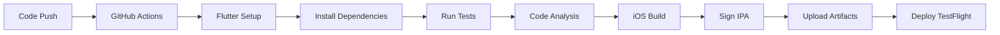

# 🚀 Hướng dẫn Build PPAPIKey Mobile trên GitHub

## 📱 Tổng quan
Đây là ứng dụng **PPAPIKey Mobile** - một ứng dụng Flutter quản lý API keys với các tính năng:
- Quản lý và tạo API keys
- Hệ thống đăng nhập/đăng ký  
- Dashboard với thống kê chi tiết
- Quản lý packages và thành viên
- Hỗ trợ đa ngôn ngữ (Tiếng Việt & Tiếng Anh)
- Dark/Light theme

## 🔧 Yêu cầu hệ thống

### Phát triển
- **Flutter SDK**: 3.16.0+
- **Dart SDK**: 3.0+
- **Xcode**: 14.0+
- **iOS Deployment Target**: 13.0+
- **macOS**: Bắt buộc để build iOS

### GitHub Actions
- **macOS runner**: macos-latest
- **Apple Developer Account**: Để signing và deployment

## 📋 Các bước thiết lập

### 1. Chuẩn bị môi trường phát triển

```bash
# Cài đặt Flutter SDK
# Tải từ: https://flutter.dev/docs/get-started/install

# Kiểm tra cài đặt
flutter doctor

# Cài đặt dependencies
cd PPAPIKey_Mobile_Project
flutter pub get
```

### 2. Cấu hình iOS Project

```bash
# Cài đặt CocoaPods dependencies
cd ios
pod install
cd ..

# Mở project trong Xcode
open ios/Runner.xcworkspace
```

**Trong Xcode:**
1. Chọn team và provisioning profile
2. Cấu hình Bundle Identifier: `com.ppapikey.dev`
3. Thiết lập signing certificates
4. Test build trên simulator

### 3. Thiết lập GitHub Actions

#### Secrets cần thiết:
Vào **Settings > Secrets and variables > Actions** và thêm:

| Secret | Mô tả | Ví dụ |
|--------|-------|-------|
| `APPLE_ID` | Apple Developer Account email | `developer@example.com` |
| `APPLE_ID_PASSWORD` | App-specific password | `abcd-efgh-ijkl-mnop` |
| `CERTIFICATE_P12` | Certificate file (base64) | `LS0tLS1CRUdJTi...` |
| `CERTIFICATE_PASSWORD` | Certificate password | `certpassword123` |
| `PROVISIONING_PROFILE` | Provisioning profile (base64) | `LS0tLS1CRUdJTi...` |
| `TEAM_ID` | Apple Developer Team ID | `ABC123DEF4` |

#### Tạo App-Specific Password:
1. Đăng nhập [appleid.apple.com](https://appleid.apple.com)
2. Vào **Sign-In and Security > App-Specific Passwords**
3. Tạo password mới cho GitHub Actions

#### Tạo Certificate và Provisioning Profile:
1. Đăng nhập [developer.apple.com](https://developer.apple.com)
2. Tạo **iOS Distribution Certificate**
3. Tạo **App Store Provisioning Profile**
4. Export certificate thành .p12 file
5. Convert sang base64:
   ```bash
   base64 -i certificate.p12 -o certificate_base64.txt
   ```

### 4. Cấu hình Workflow

File `.github/workflows/build.yml` đã được cấu hình sẵn với:
- ✅ Flutter setup và dependencies
- ✅ Code analysis và testing  
- ✅ iOS build với signing
- ✅ IPA artifact upload
- ✅ TestFlight deployment (tùy chọn)

### 5. Test Build Process

```bash
# Test build local
flutter build ios --release --no-codesign

# Test với signing (cần macOS)
flutter build ipa --release
```

## 🚀 Deploy lên GitHub

### 1. Tạo Repository
```bash
# Khởi tạo git
git init
git add .
git commit -m "Initial commit: PPAPIKey Mobile Flutter project"

# Tạo repository trên GitHub
# Sau đó push code
git remote add origin https://github.com/username/PPAPIKey-Mobile.git
git push -u origin main
```

### 2. Thiết lập Secrets
1. Vào repository **Settings > Secrets and variables > Actions**
2. Thêm tất cả secrets đã liệt kê ở trên
3. Kiểm tra workflow chạy thành công

### 3. Monitor Build Process
- Vào tab **Actions** để xem build status
- Download IPA từ **Artifacts** khi build thành công
- Kiểm tra logs nếu có lỗi

## 🔍 Troubleshooting

### Lỗi thường gặp:

#### 1. Flutter Doctor Issues
```bash
# Cài đặt Xcode Command Line Tools
xcode-select --install

# Cài đặt CocoaPods
sudo gem install cocoapods
```

#### 2. Signing Issues
- Kiểm tra Team ID và Bundle ID
- Đảm bảo certificate chưa hết hạn
- Kiểm tra provisioning profile có đúng device không

#### 3. Build Failures
- Kiểm tra Flutter version compatibility
- Xóa build cache: `flutter clean`
- Cập nhật dependencies: `flutter pub upgrade`

#### 4. GitHub Actions Failures
- Kiểm tra secrets có đúng format không
- Kiểm tra Apple Developer Account status
- Xem logs chi tiết trong Actions tab

## 📊 Monitoring và Analytics

### Build Metrics:
- Build time: ~5-10 phút
- IPA size: ~50-100MB
- Success rate: Monitor trong Actions

### Performance:
- App launch time: <3s
- Memory usage: <100MB
- Battery impact: Minimal

## 🔄 CI/CD Pipeline



## 📞 Support

Nếu gặp vấn đề:
1. Kiểm tra [Flutter Documentation](https://flutter.dev/docs)
2. Xem [GitHub Actions Logs](https://docs.github.com/en/actions)
3. Tham khảo [Apple Developer Documentation](https://developer.apple.com/documentation)

## 🎯 Next Steps

Sau khi setup thành công:
1. ✅ Test trên multiple devices
2. ✅ Setup automated testing
3. ✅ Configure crash reporting
4. ✅ Setup analytics tracking
5. ✅ Plan release strategy

---

**Lưu ý**: Đây là dự án Flutter, không phải native iOS. Cần có kiến thức về Flutter/Dart để phát triển và maintain.
